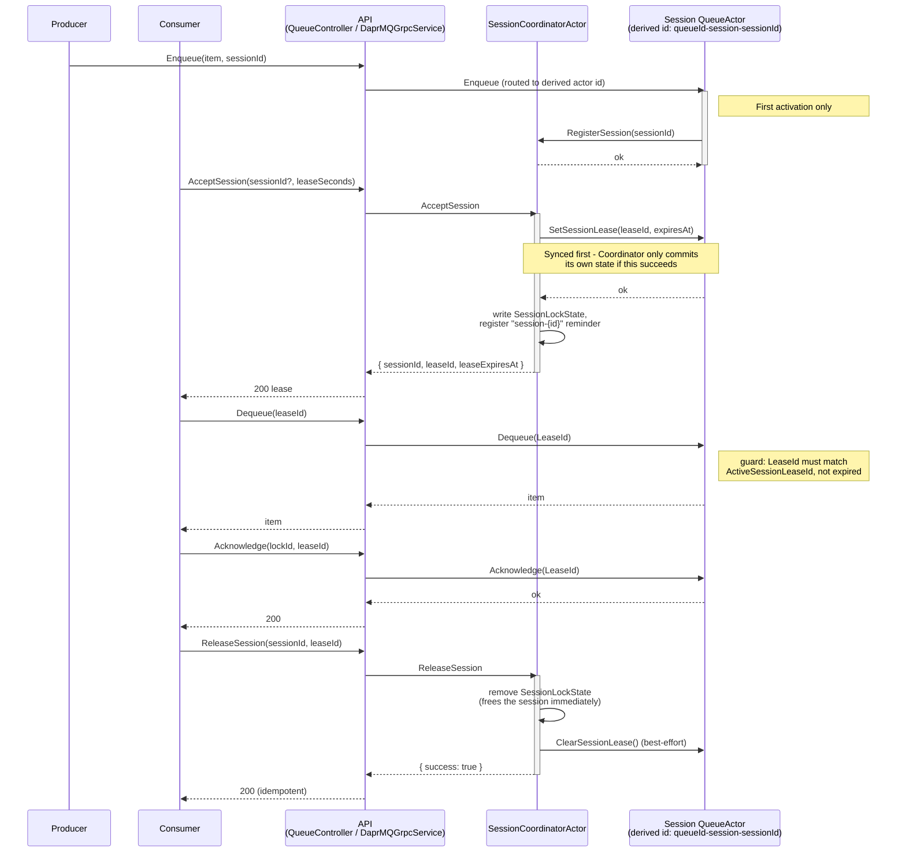

# Implementation: Sessions for DaprMQ

## Context

DaprMQ Sessions add Azure Service Bus-style ordered sub-groups within a queue: a consumer calls `AcceptSession` to negotiate exclusive, time-boxed ownership of one session (either "any available" or a specific named session, for sticky routing), receives a lease it must heartbeat to keep, and loses it on heartbeat lapse (reclaimed for another consumer). Messages tagged with the same `SessionId` preserve strict relative order; different sessions on the same queue can be consumed in parallel.

**Why:** Give ordered sub-groups their own independent consumer without giving up per-group FIFO — the FIFO group/partition key use case, modeled on a leased-ownership pattern rather than a bare partition tag.

**Architecture:** Each session is a full, ordinary `QueueActor` instance, addressed by a derived id (`{queueId}-session-{sessionId}`). A separate, dedicated `SessionCoordinatorActor` type owns the session directory and lease issuance — it never stores queue items itself, mirroring how `TopicActor` delegates storage to sibling `QueueActor` instances rather than growing `QueueActor` (see [SINK_IMPLEMENTATION.md](SINK_IMPLEMENTATION.md) and `PUBSUB-PLAN.md` for the same coordinator-delegates-to-`QueueActor` shape applied elsewhere in this codebase).

## Architecture Overview

```
Enqueue (sessionId set) → routed by QueueController/DaprMQGrpcService →
                        QueueActor "{queueId}-session-{sessionId}" (plain QueueActor, unmodified)
                             │
                             │ OnActivateAsync (first activation only)
                             ▼
                        RegisterSession(sessionId) → SessionCoordinatorActor "{queueId}"
                                                          (SessionDirectory += sessionId)

AcceptSession(sessionId?, leaseSeconds) → SessionCoordinatorActor "{queueId}"
                             │
                             │ 1. SetSessionLease(leaseId, expiresAt) → session's QueueActor
                             │    (sync first - only on success does SessionCoordinatorActor commit)
                             ▼
                        SessionLockState written, "session-{sessionId}" reminder registered
                             │
                             ▼
                        200 { sessionId, leaseId, leaseExpiresAt }

Dequeue / DequeueLocked / Acknowledge / ExtendLock / DeadLetter (LeaseId set) → session's QueueActor
                             │
                             │ guard: ActiveSessionLeaseId must be unset, or match LeaseId
                             │        and ActiveSessionLeaseExpiresAt must not have passed
                             ▼
                        normal QueueActor logic (segments/priority/offload, unmodified)

ReleaseSession(sessionId, leaseId) → SessionCoordinatorActor "{queueId}"
                             │ 1. remove SessionLockState (frees the session immediately)
                             │ 2. best-effort ClearSessionLease → session's QueueActor
                             ▼
                        200 { success: true }  (idempotent - missing/already-released also 200)
```

### Sequence Diagram

The box diagram above shows the four independent flows; this shows one consumer's full life cycle against a single session, in call order, across the four participants (API is `QueueController`/`DaprMQGrpcService` - REST and gRPC unary go through the identical sequence).



## Key Design Decisions

1. **Each session is a plain `QueueActor` instance, not a nested structure inside one actor.** An earlier draft proposed `ActorMetadata.Sessions: Dictionary<string, Dictionary<int, QueueMetadata>>` with a `QueueScope` threaded through every segment/priority/offload method. Rejected: no real parallelism (still one actor's single-threaded turn queue), duplicated logic via refactor rather than reuse, and a widened corruption blast radius (one session's corrupted segment would flag the whole actor via `ActorMetadata.ErrorMessage`). The chosen shape reuses 100% of the existing segment/priority/offload machinery unmodified — a session actor's `Enqueue`/`Dequeue`/`DequeueLocked`/`Acknowledge`/`ExtendLock`/`DeadLetter` are the exact same code paths ungrouped queues already use.
2. **`SessionCoordinatorActor` is a separate actor type, not bolted onto `QueueActor`.** A first implementation pass put the directory and lease issuance on the queue's own `QueueActor` instance; rejected once implemented, since every `QueueActor` instance — including ordinary, session-free ones — ended up carrying directory/lease fields it would never use. Enforcement (the lease guard) stays on `QueueActor` because it's inherently inline, per-instance state; coordination (which sessions exist, who holds a claim) is fleet-level bookkeeping with nothing to do with queue storage, so it moved to its own type, addressed by the same id string as its `QueueActor` but as a different Dapr actor type (`(type, id)` identity means no collision).
3. **Enqueue routing is a controller/gRPC-layer concern, not actor-to-actor forwarding.** `QueueController`/`DaprMQGrpcService` resolve `new ActorId(sessionId != null ? $"{queueId}-session-{sessionId}" : queueId)` before calling `Enqueue`. An actor-forwarding design (the queue actor's own `Enqueue` inspecting a `SessionId` on each item and forwarding) was rejected: it would add an unbounded, avoidable hop on every session-tagged enqueue forever, not just the first one.
4. **Session directory population is lazy self-registration, not eager.** `AcceptSession`'s "any available" mode needs some directory of known session ids, but controller-level routing has no memory across calls to build one. A session `QueueActor` instance instead self-registers with its `SessionCoordinatorActor`'s directory once, lazily, on its own first activation (`OnActivateAsync`) — persisted via `HasRegisteredSession` so it's attempted at most once, ever, even across reactivation after idle timeout. Registration cost is O(distinct sessions ever created), not O(enqueues): the first message to a new session pays one extra activation-time hop, the 10,000th pays zero. Best-effort — a failure is logged and retried on the next activation, never blocking the triggering `Enqueue`/`Dequeue` call.

## Storage Model

Actor-id convention: `{queueId}-session-{sessionId}` — the same family as `{queueId}-deadletter`/`{queueId}-sink`. A session actor's own segments are plain `queue_{priority}_seg_{n}`, identical to any other `QueueActor`, because it *is* one; `SessionCoordinatorActor` never touches segment/priority state at all.

`SessionDirectory` is a directory of session ids that have ever registered, **not** a live "has unconsumed items" index — `SessionCoordinatorActor` has no cheap way to know whether a session actor is currently empty without asking it. This is a deliberate, accepted limitation: `AcceptSession` in "any available" mode may hand out a lease to a session whose `QueueActor` turns out to be empty; the normal client flow (claim → dequeue → 204 → release → retry) already handles this as an ordinary fast-path case. Directory entries are never removed (a concern only for very high-cardinality session-key use cases, e.g. per-order-id keys — not addressed here).

## Leasing & Enforcement

State key `session-lock_{sessionId}`, held on `SessionCoordinatorActor` only:

```csharp
public record SessionLockState
{
    public required string SessionId { get; init; }
    public required string LeaseId { get; init; }
    public required double CreatedAt { get; init; }
    public required double ExpiresAt { get; init; }
}
```

Reuses the existing lock TTL clamp (1–300s, 30s default) and the existing reminder pattern item locks already use (`IRemindable`, reminder prefix `session-`); on fire, deletes the lock state and saves — simpler than `QueueActor`'s item-lock reminder branch since a session lease never holds item payload to requeue.

Enforcement lives on the session's own `QueueActor` instance — two fields, meaningful only on a session-scoped instance:

```csharp
public string? ActiveSessionLeaseId { get; init; }
public double? ActiveSessionLeaseExpiresAt { get; init; }
```

...and two internal, actor-to-actor-only methods (`SetSessionLease`/`ClearSessionLease`, invoked only by `SessionCoordinatorActor`, never exposed through `QueueController`/gRPC — same trust tier as `BlobReaperActor`'s schedule/postpone-deletion methods). `DequeueRequest`/`DequeueLockedRequest`/`AcknowledgeRequest`/`ExtendLockRequest`/`DeadLetterRequest` each carry an optional `LeaseId`; a guard at the top of each of the five corresponding `QueueActor` methods rejects the call (`SESSION_LEASE_EXPIRED`/`INVALID_LEASE_ID`) if `ActiveSessionLeaseId` is set and the incoming `LeaseId` doesn't match or the lease has expired. On a plain (non-session) queue actor, `ActiveSessionLeaseId` is always null, so the guard is a no-op — existing behavior is untouched. This closes the gap that a deterministic, guessable session actor id would otherwise leave open: without it, anyone who can compute the id could dequeue a session's queue without ever calling `AcceptSession`. **`LeaseId` is a bearer token** — knowing `sessionId` alone is not sufficient once a lease is active.

**Sync ordering is load-bearing:**
- `AcceptSession`: sync `SetSessionLease` onto the target session's `QueueActor` **first**. Only on success does `SessionCoordinatorActor` write its own lease state and register the reminder — if the sync fails, its state is untouched and the session remains genuinely unclaimed (`SESSION_ACTOR_UNAVAILABLE`), safe to retry.
- `RenewSessionLease`: same order — sync the session actor first, then extend `SessionLockState.ExpiresAt` and re-register the reminder.
- `ReleaseSession`: reverse order is fine — remove `SessionCoordinatorActor`'s own lock state first (frees the session immediately), then best-effort `ClearSessionLease` on the session actor. A failed best-effort call self-heals at the session actor's own cached `ActiveSessionLeaseExpiresAt`.

## Transport

REST + gRPC unary for `AcceptSession`/`RenewSessionLease`/`ReleaseSession` (admin/manual operations, matching the existing dual-surface convention), plus a gRPC bidirectional streaming RPC, `ConsumeSession`, for the managed consume loop. `DaprMQGrpcService.ConsumeSession` is a stateless orchestrator (Dapr actors can't hold a stream open across turns) that calls `AcceptSession` server-side, then runs a poll loop against the derived session actor and a lease-renewal check at roughly `lease_seconds/2`, using the stream's own liveness as the heartbeat — on stream close, the server releases the session immediately, materially faster than waiting out the lease TTL. See [API_REFERENCE.md](API_REFERENCE.md#sessions) for the wire format.

## State Keys (additions)

| State key | Type | Actor type / role |
|---|---|---|
| `metadata` | `ActorMetadata` (extended: `HasRegisteredSession`, `ActiveSessionLeaseId`, `ActiveSessionLeaseExpiresAt`) | `QueueActor`, both roles (fields meaningful only on a session-scoped instance) |
| `metadata` | `SessionCoordinatorMetadata` (`SessionDirectory`) | `SessionCoordinatorActor` — separate actor type, no key collision with `QueueActor`'s own `metadata` |
| `session-lock_{sessionId}` | `SessionLockState` | `SessionCoordinatorActor` only |
