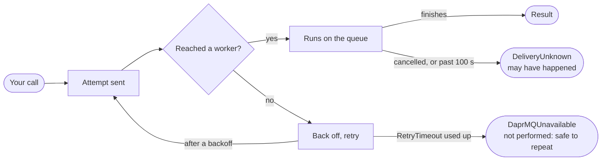

# DaprMQ SDKs: timeouts, retries and failures

## The short version

A DaprMQ SDK call waits through a short outage for up to 30 seconds, then fails with an error that tells you whether the operation happened. This guide is for application developers using the .NET, Python, TypeScript or Java SDK. It describes the retry and readiness behaviour from [proposals/readiness-and-retries.md](../proposals/readiness-and-retries.md); the contract every SDK implements is [sdks/testing/RETRIES_AND_READINESS.md](../sdks/testing/RETRIES_AND_READINESS.md).

The rules to program for:

1. **An outage is retried for you.** If DaprMQ can't serve a call (a worker restarting, a deploy in progress), the SDK and server keep trying for up to `RetryTimeout`, 30 seconds by default.
2. **Slow is not failed.** A call that reached a busy queue waits its turn. The retry timeout never cuts it short; only your own cancellation or a 100-second safety limit does.
3. **Every failure tells you whether it happened.** `DaprMQUnavailable` means it certainly did not happen and is safe to repeat. `DeliveryUnknown` means it may or may not have happened.
4. **`DeliveryUnknown` is never retried automatically**, except for an enqueue where every item has an idempotency key. What you do next depends on the operation (see [What to do after DeliveryUnknown](#what-to-do-after-deliveryunknown)).
5. **Give enqueued items idempotency keys**, or turn on `AutoIdempotencyKeys`, if you can't tolerate duplicates.
6. **Cancel when you stop caring.** Cancellation stops waiting and retrying immediately and surfaces as your language's normal cancellation.
7. **Use `WaitForReady()` at startup**, not a test enqueue.
8. **Anything else in front of DaprMQ has its own timeout.** A proxy or ingress that gives up first produces an error without DaprMQ's delivery information: treat it as "may have happened".

## The life of a call

A call has two phases with separate limits. While it can't reach a worker, it is retried within `RetryTimeout`. Once it has reached one, it runs to completion unless you cancel it or it passes 100 seconds.

Only the retry loop is ever repeated automatically; a call that reached a worker is never sent twice by the SDK or the server.

| Phase | Limited by | Ends as |
| --- | --- | --- |
| Can't reach a worker | `RetryTimeout` on the client; at most 30 s on the server | A result once a worker returns, or `DaprMQUnavailable` |
| Reached a worker | Your cancellation, or 100 s | A result, or `DeliveryUnknown` if it was cut off |

The server takes about 5 seconds to report that no worker is available, so each retry takes roughly that long. No retry starts with less than 6 seconds of `RetryTimeout` left, so an outage longer than `RetryTimeout` is reported a little before it runs out.

## Configuration

Two client options control the behaviour. Both are set when you build the client.

| Option | Default | What it does |
| --- | --- | --- |
| `RetryTimeout` | 30 s | How long one call keeps retrying while DaprMQ can't serve it. Sent to the server so it stops retrying at the same time. `0` turns client retries off. |
| `AutoIdempotencyKeys` | off | Gives every enqueued item without a key a random one, so an enqueue with an unknown outcome is retried safely. Costs the server one extra state write per item. |

| SDK | Setting the options |
| --- | --- |
| .NET | `new DaprMQClient(http, channel, new DaprMQRetryOptions { Timeout = TimeSpan.FromSeconds(30), AutoIdempotencyKeys = true })`, or `Retry = new() { … }` on `DaprMQClientOptions` |
| Python | `DaprMQClient(http_base_url=…, grpc_address=…, retry=RetryOptions(timeout=30.0, auto_idempotency_keys=True))` |
| TypeScript | `new DaprMQClient({ httpBaseUrl, grpcAddress, retry: { timeoutMs: 30_000, autoIdempotencyKeys: true } })` |
| Java | `DaprMQClient.create(httpUrl, grpcTarget, RetryOptions.defaults().withTimeout(Duration.ofSeconds(30)).withAutoIdempotencyKeys(true))` |

### Limits on a single call

A call that reached DaprMQ runs until one of these ends it. The first to fire wins.

| Limit | Default | Where it comes from |
| --- | --- | --- |
| Your cancellation | none | `CancellationToken` (.NET), task cancellation or `asyncio.wait_for` (Python), `signal` (TypeScript), thread interrupt (Java) |
| The SDK's per-call HTTP limit | 100 s | .NET: `HttpClient.Timeout`. Python: the SDK's own client (an `httpx.AsyncClient` you pass in keeps its own timeout, which is 5 s by default). Java: 100 s per attempt. TypeScript: no SDK limit, Node's `fetch` waits up to 300 s. |
| The server's safety limit | 100 s | `DELIVERY_ATTEMPT_MAX_SECONDS`, for a worker that has hung |
| Your explicit deadline | none | `daprmq-timeout` header in milliseconds, raw REST only. The SDKs don't send one. |

### Server settings (for whoever runs DaprMQ)

| Setting | Default | Effect on callers |
| --- | --- | --- |
| `DELIVERY_RETRY_MAX_SECONDS` | 30 | Longest the server retries a call it couldn't deliver, whatever the client asks for |
| `DELIVERY_ATTEMPT_MAX_SECONDS` | 100 | Longest one delivered call may run before the server gives up as unknown |

Raw REST callers can send `daprmq-retry-timeout` (retry window, ms) and `daprmq-timeout` (a hard deadline for the whole call, ms). A deadline that cuts off a call already in progress turns it into `DELIVERY_UNKNOWN`, so set one only when you really can't wait longer.

## The errors you will see

Every failure falls into one of four groups, and the group tells you whether the operation happened. Both new errors extend each SDK's base DaprMQ error, so existing catch blocks still catch them.

| Group | .NET | Python | TypeScript | Java | Did it happen? |
| --- | --- | --- | --- | --- | --- |
| Unavailable | `DaprMQUnavailableException` | `DaprMQUnavailableError` | `DaprMQUnavailableError` | `DaprMQUnavailableException` | **No.** Safe to repeat later |
| Delivery unknown | `DeliveryUnknownException` | `DeliveryUnknownError` | `DeliveryUnknownError` | `DeliveryUnknownException` | **Maybe.** Depends on the operation |
| Cancelled | `OperationCanceledException` | `CancelledError` (or `TimeoutError` from `asyncio.wait_for`) | the signal's abort reason | `CancellationException` (interrupt flag kept) | **Maybe**, if the call had already been sent |
| Domain errors | `LockNotFoundException`, `ValidationException`, … | `LockNotFoundError`, … | `LockNotFoundError`, … | `LockNotFoundException`, … | The server ran it and answered; unchanged |

What each error carries:

- **Unavailable:** the operation name and the queue id. The server reported it couldn't serve the call (no worker available) or the connection was refused, and retrying ran out of `RetryTimeout`.
- **Delivery unknown:** the operation name, the queue id and, for an enqueue, each item's idempotency key in order (empty where an item had none). Typical causes: the connection broke after the request was sent, or the call ran past a time limit.

Two cases look like errors but aren't: an empty queue (dequeue returns null or `None`) and a locked queue (a result with `Locked = true`).

**Errors from something in front of DaprMQ.** A load balancer, ingress or proxy may time out or fail on its own. Its response has no DaprMQ delivery information, so the SDK reports it as a plain DaprMQ error or a transport error. Treat it like delivery unknown.

## What to do after DeliveryUnknown

The safe response depends on whether repeating the operation could do harm. The SDK retries only the one case it can prove is harmless.

| Operation | Retried by the SDK? | What your code should do |
| --- | --- | --- |
| Enqueue, every item keyed | Yes, within `RetryTimeout` | Nothing: the server drops duplicates by key. Keys are remembered for 24 hours by default. |
| Enqueue, some items unkeyed | No | Re-send if a duplicate is acceptable, or check downstream first. The error lists which items had keys. |
| Dequeue with a lock | No | **Don't re-send.** If it ran, the items are locked to a lock id you never received. They return to the queue when the lock expires (the TTL you asked for), with their delivery count raised. |
| Acknowledge, extend lock, dead-letter | No | Re-sending is safe in effect. If the first attempt worked, the re-send gets `LockNotFound`: treat that as success. |
| Accept, renew or release a session | No | Accept: try again; a session claimed but unseen expires with its lease. Renew: re-send while the lease is still valid. Release: safe to re-send; an invalid lease id means it already worked. |

**Prefer idempotency keys for enqueues.** They make every enqueue safe to retry, including your own retries after a crash. Use a key that identifies the business event, such as an order id plus an event type, so a re-sent event is recognised. `AutoIdempotencyKeys` protects only against the SDK's own retries, because each new call gets fresh keys.

**Expect at-least-once delivery on the consumer side.** A dequeue whose response was lost, a lock that expired during slow processing, or an acknowledge that failed all lead to the same item being delivered again. Make handlers idempotent, or record processed ids.

## Waiting for a server

Call `WaitForReady()` before your first operation when you start alongside DaprMQ. It returns once queue operations can be served, and it writes nothing.

| SDK | Call | Bounding it |
| --- | --- | --- |
| .NET | `await client.WaitForReadyAsync(ct: token)` | cancel the token |
| Python | `await client.wait_for_ready()` | `asyncio.wait_for(…, timeout=30)` |
| TypeScript | `await client.waitForReady({ signal })` | `AbortSignal.timeout(30_000)` |
| Java | `client.waitForReady(Duration.ofSeconds(30))` | returns `false` if time runs out; `waitForReady()` waits until interrupted |

It watches a gRPC health service and reconnects while the server isn't up yet. It has no limit of its own, so always bound it. Two services exist:

| Service | Ready means | Use it for |
| --- | --- | --- |
| `daprmq.DaprMQ.operations` (the default) | Queue operations can be served end to end. On a split deployment, at least one worker is available. | Application startup, test fixtures, smoke checks |
| `daprmq.DaprMQ` | This server instance is up and connected | Infrastructure checks; Kubernetes readiness uses the same signal |

The same signals are on HTTP: `GET /health/operations` and `GET /health/ready` return 200 when ready, 503 when not.

Don't send a test enqueue to check readiness. It leaves a queue behind in the state store on every start. You also don't need `WaitForReady()` before every call: once running, retries cover short outages.

## Scenarios

| Situation | What your code sees | What to do |
| --- | --- | --- |
| A worker restarts, or a deploy rolls the workers | The call takes a few extra seconds, then succeeds | Nothing. This is what the retries are for. |
| Every worker down for longer than `RetryTimeout` | `DaprMQUnavailable` after roughly `RetryTimeout`, often a few seconds sooner | Back off and try later, buffer locally, or fail the request upstream. Nothing was written. |
| DaprMQ unreachable (wrong address, network down) | `DaprMQUnavailable` once `RetryTimeout` runs out | Check configuration. A refused connection counts as not performed. |
| Thousands of concurrent calls on one queue | Calls get slower but succeed; past 100 s a call ends as `DeliveryUnknown` | Spread load across queues, or limit concurrency per queue on your side |
| A worker hangs mid-call | `DeliveryUnknown` after up to 100 s, or sooner if you cancel | Handle it per operation (see above) |
| A proxy in front times out first | A plain error or `504` without delivery information | Treat as delivery unknown; raise the proxy timeout above the longest call you expect |

### Patterns

- **Match timeouts from the outside in.** Your request handler's deadline should be longer than `RetryTimeout` plus a typical call. A gateway or ingress in front of DaprMQ should allow longer than the server's 100-second call limit, or your callers will see the proxy's error instead of DaprMQ's.
- **Shorten `RetryTimeout` for interactive paths.** A user waiting on a web request may prefer a fast `DaprMQUnavailable` after 5 seconds to a 30-second wait. Values under about 6 seconds give a single attempt, because the server takes about 5 seconds to report that no worker is available.
- **Lengthen it for background producers.** A batch job that can wait gains nothing from failing early. Retries stop at the server's cap, 30 seconds by default, so ask your operator if you need longer.
- **Size lock TTLs to your slowest handler.** A lock that expires while you're still processing returns the item to the queue, and a later acknowledge gets `LockExpired`. Extend the lock for long work.
- **Cancel what you no longer need.** Cancellation stops waiting and retrying at once. Like any call cut off after it was sent, a cancelled call may still have run, so handle it as you would `DeliveryUnknown`.
- **Log the delivery outcome.** Record the operation and queue id from both new errors. A rising count of `DaprMQUnavailable` means an outage; a rising count of `DeliveryUnknown` usually means overload or a hung worker.

## Checklist

- [ ] `RetryTimeout` set deliberately for each kind of caller (interactive, background)
- [ ] Enqueues that must not duplicate carry business idempotency keys, or `AutoIdempotencyKeys` is on
- [ ] `DaprMQUnavailable` handled: back off, buffer, or fail upstream
- [ ] `DeliveryUnknown` handled per operation, never by blindly re-sending a dequeue
- [ ] Consumers are idempotent, since items can be delivered more than once
- [ ] Lock TTLs cover the slowest handler, or locks are extended
- [ ] Proxy and ingress timeouts are longer than DaprMQ's 100-second call limit
- [ ] Startup and test fixtures use `WaitForReady()` with a bound, never a probe enqueue
- [ ] Both new errors are logged with operation and queue id

## FAQ

**Why didn't my call fail sooner during an outage?** It was retrying for up to `RetryTimeout`. Lower it, or cancel, if you need an answer faster.

**Why did a call take longer than `RetryTimeout`?** It had reached DaprMQ and was waiting its turn on a busy queue. The retry timeout applies only while DaprMQ can't be reached.

**Can I retry after `DaprMQUnavailable`?** Yes, always: the operation was not performed.

**Can I retry after `DeliveryUnknown`?** Only where repeating is harmless: a keyed enqueue, an acknowledge, an extend, a dead-letter. Never re-send a dequeue to recover from it.

**Does `AutoIdempotencyKeys` stop duplicates from my own retries?** No. It covers the SDK's retries within one call; your own re-send is a new call with new keys. Use business keys for that.

**Does this apply to session streams?** No. The streaming consumer (`ConsumeSession`, `SessionQueueConsumer`) reconnects on its own and isn't affected by `RetryTimeout`.
